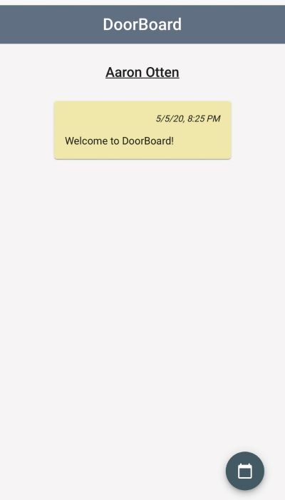

# DoorBoard

## Contents
- [DoorBoard](#doorboard)
  - [Contents](#contents)
  - [Introduction](#introduction)
  - [Libraries Used](#libraries-used)
    - [Client Side](#client-side)
    - [Server Side](#server-side)
    - [Database](#database)
    - [Deployment](#deployment)
    - [Authentication](#authentication)
  - [Resources](#resources)
  - [Known Issues](#known-issues)
  - [API](#api)
  - [Set up and Deployment](#set-up-and-deployment)

## Introduction

We were approached by a professor at the University of Minnesota Morris to create an alternative announcement system to replace the use of sticky notes posted on a door. DoorBoard allows owners to create notes to display to their viewers, accessible from anywhere. This application is currently intended to be used to announce things like “running late due to traffic” or  “Office Hours are cancelled today, my child got sick.”

Owners can create notes, edit notes,  pin written notes to the top of the page, trash notes, and view their trashcan of deleted notes to decide whether to permanently delete the notes or reuse them. Additionally, each note is timestamped with the data and time when the note was created or last edited. Owners also have access to a button which generates a PDF containing the URL of the viewer page for their DoorBoard, as well as a QR code linking to that same URL.
Viewers can see the notes left by the owner and see the owner’s Google Calendar using the link on the viewer page.

This project is made possible by the students and faculty of CSci 3601, Software Development and Design, at the University of Minnesota Morris, and a special thanks to Rachel Johnson, Professor at the University of Minnesota Morris for being our customer for this project. 

Software Design Spring 2020 Iteration 3  
Team Name: 2016 Summer Olympic Athletes from the Cayman Islands  
Team Members: Aaron Otten, Audrey Le Meur, Erik Rauer, Kyle Fluto, Luke Burdette, & Trent Merkins

This repository began as team Nicolai Thärichen’s code for iteration 1 of the DoorBoard app. It was then expanded upon in iteration 2 by Team Rocket. It was then used as the code base for iteration 3 by the 2016 Olympic Athletes from the Cayman Islands.

| Owner DoorBoard | Viewer Doorboard |
|-----------------|------------------|
|     |     |

## Libraries Used

### Client Side
* Angular 9 is used to build the client side.
* TypeScript is the language most used on the client side.
* Jasmine and Karma are used for testing.
* Protractor is used for end to end testing
* Gradle is used to tell Javalin to orchestrate the Client Side.
* JsPDF (jspdf) is used for PDF generation.
* Kjua (kjua-svk) is used for QR code generation.
* Auth0 SDK for Single Page Applications (auth0-spa-js) is used for user authentication on the client side.
* Node.js is used for asynchronous API.

### Server Side
* Java is the language used on the Server Side.
* Javalin is used as a lightweight web framework.
* JUnit is used for testing.
* Mockito is used to mock various classes to assist in testing.
* Gradle is used to build the project.

### Database
* MongoDB is used as our database for storing notes and owners.

### Deployment
* Docker is used to contain software in its own packages and still allow it to communicate with each other.
* DigitalOcean is used as a hosting service.

### Authentication
* Auth0 is used to generate secure tokens with which we authenticate our users.
* Google OAuth 2.0 is used to log users in through their google accounts.

## Resources
| Client | Server | Database | Deployment |
|--------|--------|:--------:|:----------:|
| <ul> <li> [Angular Documentation](https://angular.io/docs)</li> <li>[Jasmine Documentation](https://jasmine.github.io/)</li> <li>[Karma Documentation](https://karma-runner.github.io/)</li> <li>[Protractor Documentation](https://www.protractortest.org/#/api) </li> <li>[Gradle Guides](https://gradle.org/guides/)</li> <li>[JsPDF Repository](https://github.com/MrRio/jsPDF)</li> <li>[Kjua Repository](https://github.com/werthdavid/kjua)</li> <li>[Auth0 Documentation](https://auth0.com/docs/)</li> <li>[Node.js Documentation](https://nodejs.org/en/docs/)</li> </ul> | <ul> <li>[Mockito Documentation](https://javadoc.io/doc/org.mockito/mockito-core/latest/org/mockito/Mockito.html)</li> <li>[Javalin Documentation](https://javalin.io/documentation)</li> </ul>| <ul> <li> [MongoDB Documentation](https://docs.mongodb.com/) </li> </ul> | <ul> <li> [Docker Documentation](https://docs.docker.com/) </li> <li> [Digital Ocean Tutorials](https://www.digitalocean.com/community/tutorials) </li> </ul> |

## Known Issues

Known bugs and potential enhancements include:
* Additional client side testing: client-side testing is minimal and coverage should be increased
* Fix forced reload on owner doorboard: on certain browsers, page will repeatedly reload unnecessarily
* Jumping into the middle of the page: occasionally, page will load into the middle of the page rather than the top
* Decrease side margins in mobile

## API

 A full description of the API is can be found in [HTTP_API.md](HTTP_API.md).

 ## Set up and Deployment

 Set up instructions are in [SETUP.md](SETUP.md)  
 Instructions on how to create a DigitalOcean Droplet are in [DEPLOYMENT.md](DEPLOYMENT.md).
